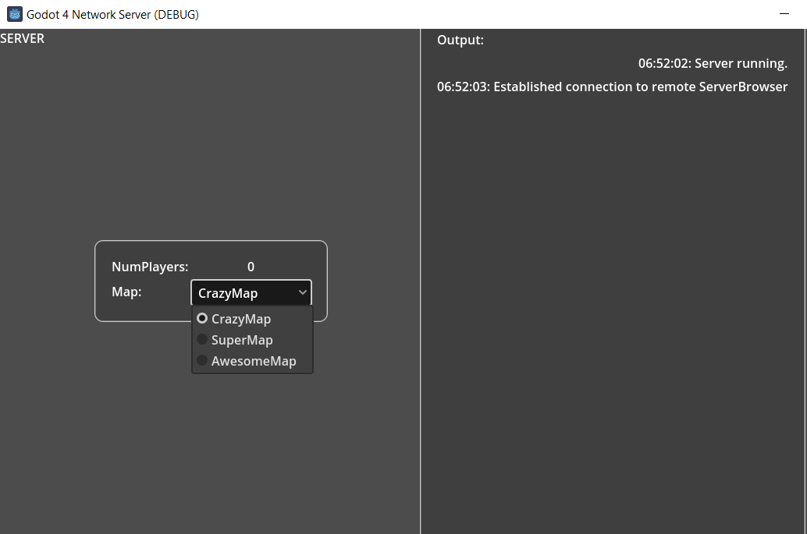
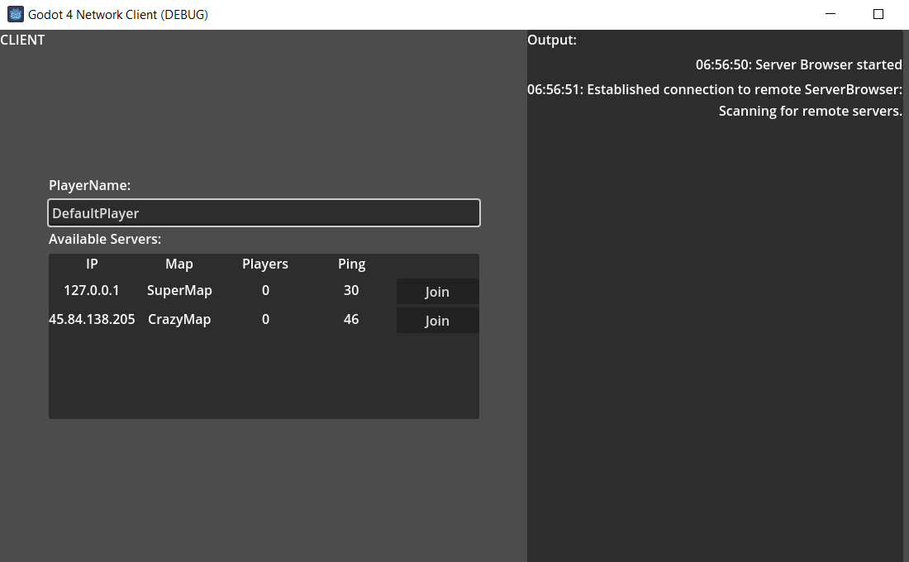

# GodotServerBrowser
 A server browser for use in Godot 4!
 (can be adapted to Godot 3, currently uses a lambda function in the serverBrowser-UI on the client, which can be replaced with something else for Godot 3).

 ## Disclaimer:
I am not a professional in network communikation. Many of the aspects might be possible to be solved differently, feel free to adapt and change. But the general concept should work quite well!

## Working concept: 
The idea is to have a python script running on an accessible web server, to which all running game servers send a signal that they are online.<br>
The script keeps a list of all IPs, which can be retrieved from each client. The communication between servers, clients and the python script is achieved with HTTP Requests.<br><br>
On the client side, the client project retrieves the sever list and creates UDP Connections on a specific port to each server in order to:<br>
* Verify that the server is really accessible
* Retrieve information about number of players and current map

Here is a sketch of the concept:


## Files in the project:
There are two sub-projects and the python file for the remote server browser script:
### ServerDemo_Server
This is the godot project to run on the server. It has a "lobby" to which players can connect and where a fake map can be set.<br>

Please adjust in the scripts:
* ConnectionHandler.gd: IP and Port to connect to remote server browser (needs to match serverBrowser.py) and the Port to use for UDP connection to other players (needs to match Client project)

### ServerDemo_Client
This is the project to run as game client. You can enter a player name and will see a list of currently accessible game instances.<br>
You can connect to any of the servers by clicking the respective button.

Please adjust in the scripts:
* ServerAddressRetriever.gd: IP and Port to connect to remote server browser (needs to match serverBrowser.py)
* ServerInfoRetriever.gd: Port to use for UDP communication with running server instances (needs to match Server project)


### serverBrowser.py
The project contains the python script that needs to run on a remote server in the corresponding folder.<br>
Create an appopriate python environment (e.g., python 3.10) and install the following packages, e.g. with pip:
```
pip install Flask
pip install APScheduler
pip install numpy
```
The script collects IP addresses of servers via HTTPRequests and can send them to clients (again, upon HTTPRequest) <br>
Adjust IP and Port for the server accordingly to match what you entered in the Server and Client projects.

If you have an Ubuntu server and want to run the script there permanently in the background, run it with:
```
nohup python serverBrowser.py &
```
This prevents the server from shutting down when closing the console. All outputs will be stored in a file called "nohup.out". Use:
```
tail -f nohup.out
```
to display the current log of the server.