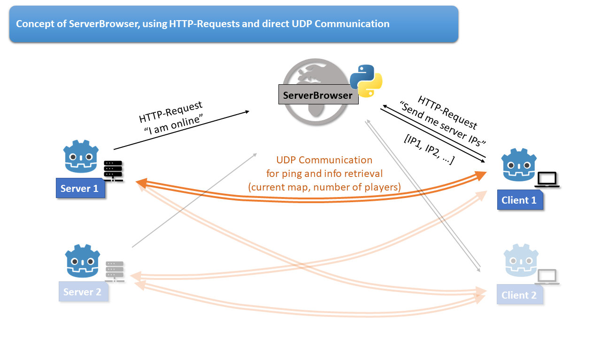

# GodotServerBrowser
 A server browser for use in Godot 4!
 (can be adapted to Godot 3, currently uses a lambda function in the serverBrowser-UI on the client, which can be replaced with something else for Godot 3).

 ## Disclaimer:
I am not a pro in such things and many of the aspects might be possible to solve differently. Feel free to adapt and change. But the general concept should work quite well!

## Working concept: 
The idea is to have a python script running on an accessible web server, acting as hub for all game servers but also clients that need to send or retrieve information.<br>
Each server sends regular updates about the current game, such as level and numbers of players.
The pyhon script pools this information in a server list, which can be retrieved from each client. The server list then can be rendered in a user interface that allows selecting a server.<br>
Here is a sketch of the concept:



## Files in the project:
This is not a fully working Godot Multiplayer Project. That would entail too much boilerplate code for all the network communication. <br>
Instead, please look at the provided files and code snippets and adjust them to however you can implement it in your project.

### serverBrowser.py
The project contains the python script that needs to run on a remote server in the corresponding folder.<br>
Create an appopriate python environment (e.g., python 3.10) and install the following packages, e.g. with pip:
```
pip install Flask
pip install APScheduler
pip install numpy
```
The script collects info about servers via HTTPRequests and can send them to clients (again, upon HTTPRequest)

### godot-Files
* communicationClientSide.gd -> Code snippets that run on the Client to retrieve server list
* communicationServerSide.gd -> Code snippets that run on the Server to send info about the running game
* ServerBrowserOnClient.tscn and ServerBrowserOnClient.gd -> Example on a server Browser UI to render the server list

